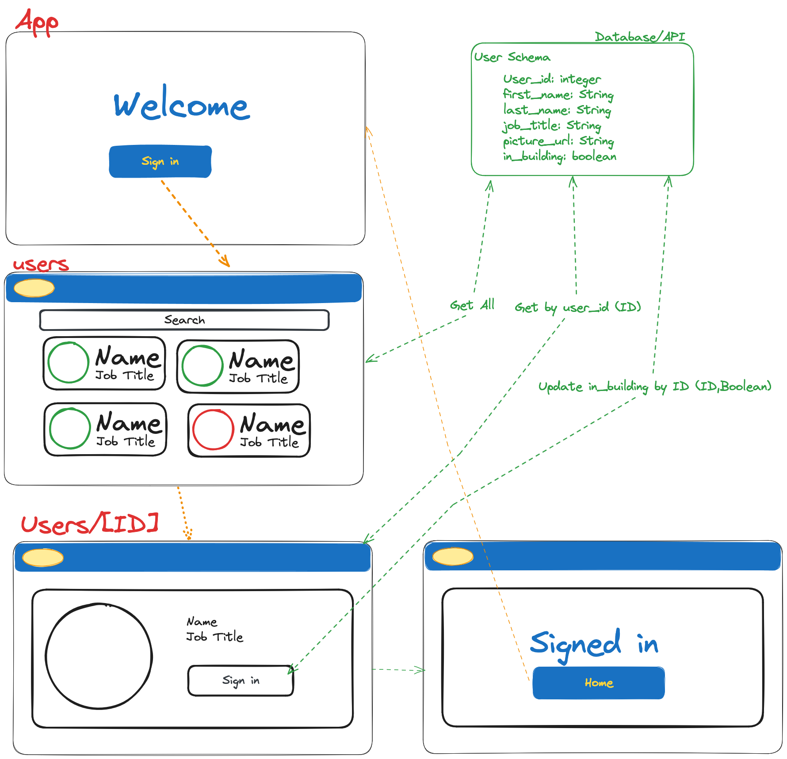

# Reception App
A simple web application built to log the comings and goings of employees to a building - Intended to be displayed on a tablet in a reception area showing all employees and whether they are currently in the building or not.

## Architecture & Design

### Database

The database is a simple Postgres database given the limited information needed. With a limited user Schema of:
```
User_id
first_name
last_name
job_title
picture_url
in_building 
```

### Technology
The site is built in NextJS, including the frontend and a basic API to interact with the server. 

TypeScript is used to ensure type safety, especially when dealing with pulling information from the server and serving this as props to the components.

### Architecture
This was designed over three main pages - A welcome page, a directory page and a single profile page for each member of staff. A rough diagram can be seen here 

The `users` page populates from an API call and then generates a custom URL with a unique ID for each member of staff. 

The `users/[ID]` page gets this ID from the URL parameters and uses an API call to get the information from the server. It was a consideration that this API call might be unnecessary given that the user information could be separated and passed through as a prop from the directory ,this was decided against to makes the site less reliant on a specific navigation method to work. Should a user directly access their URL, using a separate API call will still work.

On the `users/[ID]` there is an update that sends an update to the database about the in_building status of the user. 

### Design 
Given the application is designed for an iPad in reception, the interface is designed to be light and minimalist. Large images and fonts with contrasting colors are chosen to make the app easy to use with touch controls.

## Setup Instructions

1. **Clone the Repository**
   ```bash
   git clone https://github.com/Fordcois/reception-app
   ```
2. **Install Dependencies**
   - Navigate into the project directory and install all required packages:
   ```bash
   npm install
   ```

3. **Set Up PostgreSQL**
   - Ensure you have a PostgreSQL server running.

4. **Create and Populate the Database**
   - Create a new PostgreSQL database.
   - Populate it using the data provided in the `Database_Seed_Data.SQL` file.

5. **Configure Environment Variables**
   - In the root directory, create a `.env` file and add the following values, adjusting as needed:

   ```plaintext
   DB_USER=<your_database_user>
   DB_PASSWORD=<your_database_password>
   DB_HOST=<your_database_host>
   DB_PORT=<your_database_port>
   DB_NAME=<your_database_name>
   ```


### Database 
You will need a Postgres server running and create a database called `reception` reception' - You can populate this using the data in `Database_Seed_Data.SQL`


### Future Scope

- **Staff Registration Interface**  
  Currently, new staff members can only be added by directly modifying the database. Introducing an in-app registration feature would streamline this process. Adding webcam functionality for capturing staff photos could further enhance this feature.

- **Guest Registration**  
  To accommodate practical use, consider implementing a system for guest registration, as guests frequently visit and should be logged.

- **Enhanced User Interface**  
  Designed for a tablet, the application’s experience could benefit from smooth animations and transitions. Simple effects between screens and loading animations would improve the flow and hide loading delays during data retrieval.

- **Robust Error Handling**  
  Strengthen the application’s ability to manage and recover from errors, particularly with failed updates or API calls, to provide a more resilient user experience.

- **Improved Test Coverage**  
  Extend the existing test suite to cover additional cases, ensuring comprehensive testing and reliability across all functionalities.